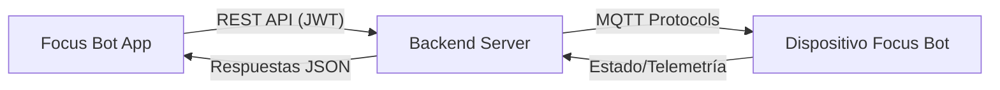

# 📱 Focus Bot — Aplicación Móvil

> **Cliente móvil multiplataforma para la gestión integral y monitorización en tiempo real del ecosistema IoT de productividad Focus Bot.**

[](https://reactnative.dev/)
[](https://expo.dev/)
[](https://jwt.io/)
[](https://mqtt.org/)

---

## 📑 Tabla de Contenidos

- [Visión General](#-visión-general)
- [Arquitectura del Sistema](#-arquitectura-del-sistema)
- [Tecnologías Utilizadas](#-tecnologías-utilizadas)
- [Estructura del Proyecto](#-estructura-del-proyecto)
- [Flujo de Datos y Autenticación](#-flujo-de-datos-y-autenticación)
- [Módulos y Pantallas](#-módulos-y-pantallas)
- [Buenas Prácticas y Calidad de Código](#-buenas-prácticas-y-calidad-de-código)

---

## 📌 Visión General

**Focus Bot App** es la interfaz centralizada del usuario para la interacción con los dispositivos físicos Focus Bot. Permite a los usuarios personalizar sus metodologías de trabajo (Pomodoro, Hitos, Temporizador), vincular sus dispositivos IoT mediante dirección MAC, seguir sus métricas de productividad en tiempo real y consultar análisis históricos de rendimiento.

---

## 🧩 Arquitectura del Sistema

La aplicación actúa como un **cliente ligero** desacoplado de la capa física del hardware. La comunicación se realiza exclusivamente a través de servicios API REST protegidos.



### Ventajas del diseño
* **Seguridad:** Los tokens de autenticación no se exponen al hardware local.
* **Desacoplamiento:** La lógica de negocio reside centralizada en el backend.
* **Escalabilidad:** Permite soportar múltiples dispositivos y usuarios concurrentes de forma transparente.

---

## 🛠️ Tecnologías Utilizadas

* **Framework:** [React Native](https://reactnative.dev/) + [Expo](https://expo.dev/)
* **UI Component Library:** [React Native Paper](https://callstack.github.io/react-native-paper/)
* **Gestión de Estado & Contexto:** React Context API (`AuthContext`)
* **Navegación:** React Navigation (Stack Navigator dinámico)
* **Seguridad & Red:** Axios / Fetch API con Interceptores HTTP + JWT Bearer Tokens

---

## 📁 Estructura del Proyecto

```text
focusbot-app/
├── assets/                 # Recursos estáticos (imágenes, fuentes, iconos)
├── src/
│   ├── components/         # Componentes UI reutilizables (DatePicker, UserBar, etc.)
│   ├── context/            # Contextos globales (AuthContext, navegación condicional)
│   ├── screens/            # Vistas principales clasificadas por módulo
│   │   ├── activities/     # Módulo CRUD de actividades (Pomodoro, Hitos, Temporizador)
│   │   ├── auth/           # Vistas de autenticación, verificación y recuperación
│   │   ├── bots/           # Vinculación y monitorización de hardware IoT
│   │   ├── history/        # Reportes analíticos e historial
│   │   └── profile/        # Configuración de usuario y parámetros del bot
│   ├── services/           # Capa de abstracción HTTP / Cliente API REST
│   └── theme/              # Definición de tokens de diseño y temas (React Native Paper)
├── app.json                # Configuración global de Expo
└── package.json            # Dependencias del proyecto
```

---

## 🔄 Flujo de Datos y Autenticación

El sistema implementa un ciclo de autenticación seguro basado en **Tokens JWT** con gestión automática de sesión:

1. **Interacción:** El usuario ejecuta una acción desde la UI.
2. **Petición HTTP:** `apiServices.js` adjunta la cabecera `Authorization: Bearer <token>`.
3. **Procesamiento:** El backend valida la firma del token y procesa la solicitud.
4. **Respuesta & Estado:** La app actualiza el estado global de la aplicación y renderiza las vistas correspondientes.
5. **Manejo de Errores (401 Unauthorized):** Si el token caduca o es inválido, los interceptores de red capturan el error 401 y ejecutan la redirección automática a la pantalla de inicio de sesión.

---

## 🖥️ Módulos y Pantallas

| Módulo | Descripción | Funcionalidades Clave |
| :--- | :--- | :--- |
| **Auth** | Control de acceso y registro de usuarios | Login, Registro, Verificación por email, Google OAuth2 |
| **Actividades** | Gestión de sesiones de trabajo | CRUD de modalidades: Pomodoro, Hitos y Temporizador |
| **Bots** | Panel de control de dispositivos IoT | Vinculación por MAC, estados (`OFFLINE`, `IDLE`, `FOCUSING`) |
| **Historial** | Métricas de rendimiento | Estadísticas avanzadas filtradas por rangos de fecha |
| **Perfil** | Gestión de cuenta y preferencias | Ajuste de datos de usuario y nivel de severidad (`LEVE`, `MEDIO`, `ALTO`) |

---

## 🧼 Buenas Prácticas y Calidad de Código

* **Seguridad en Red:** Persistencia encriptada/segura del token JWT y adjunción automática en cada Request HTTP.
* **Manejo Centralizado de Sesiones:** Cierre de sesión y re-enrutamiento automático ante respuestas `HTTP 401`.
* **Validación de Entradas:** Filtrado de datos en cliente previo al envío hacia los endpoints.
* **Componentización Modular:** Estructura atómica para garantizar la máxima reutilización de código.
* **Consistencia Visual:** Diseño escalable apoyado en el sistema de tokens de diseño de React Native Paper.
